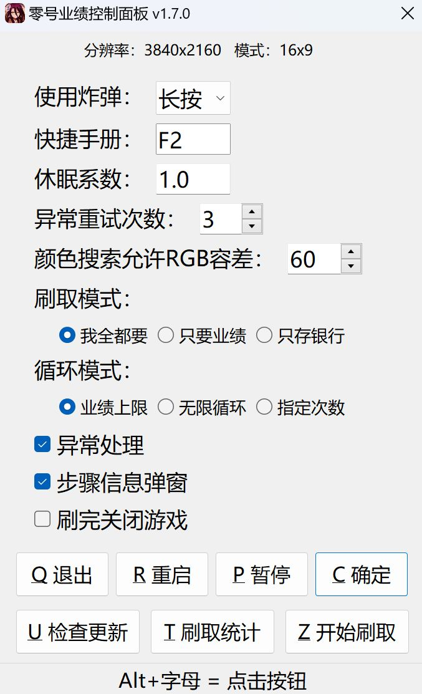

# 绝区零零号业绩刷取脚本

## 简介

- 针对零号空洞 **旧都列车·前线** 关卡设计
- 基于 [**AutoHotKey v2**](https://www.autohotkey.com) 实现的 **零号业绩** 和 **零号空洞银行存款** 快速刷取
    > 约3分钟一把，20业绩+存款到手，3小时不到就能刷满一周900业绩上限
    >  关闭存银行后约2.5分钟一把，2小时就能刷满
- 简单轻量易用，对于不同 **分辨率、帧率、缩放、HDR、字体等** 具有良好的适应性

## 使用前提

**以下要求缺一不可**

- 1. **全屏** 运行游戏
- 2. 默认 **3位及以上** 战斗角色
- 3. 已激活作战攻略的 **开局炸弹补给**

## 下载、打开方法

> PS: 程序报毒属正常现象，担心的话可以跑源码或者自行编译，怕别用用别怕

- 方法一（下载即用，懒人最爱）：

    [<<<点击进入>>>](https://gitee.com/UCPr251/zzzAuto/releases/latest)release最新版本，下载并运行该exe文件

- 方法二（适合想要diy的用户）：

    克隆/下载源码（需已安装好[autohotkey](https://www.autohotkey.com) v2版解释器），运行[零号业绩.ahk](./零号业绩.ahk)文件

## 使用方法

- Alt+P ：暂停/恢复刷取，快捷指令，也可通过控制面板修改
- Alt+C ：打开/关闭[控制面板](./控制面板.jpg)，相关信息：
    > **使用炸弹**：修改邦布插件快捷使用方式：长按/点击
    >  **快捷手册**：修改打开快捷手册的快捷键，默认F2
    >  **休眠系数**：调整脚本在加载动画时的等待时长倍率
    >  **异常重试次数**：允许总的异常时重试的次数
    >  **颜色搜索允许RGB容差**：过大可能误点，过小可能匹配失败，按需调整
    >  **战斗模式**：通用·普通攻击（一直A） / 艾莲
    >  **刷取模式**：业绩+银行 / 只要业绩 / 只存银行
    >  **循环模式**：刷至业绩达周上限 / 无限循环 / 指定刷取次数
    >  **异常处理**：关闭后，任何意料之外的情况都将直接结束刷取并抛出错误，用于排查错误原因
    >  **步骤信息弹窗**：是否输出刷取过程中每个步骤的信息弹窗
    >  **刷完关闭游戏**：业绩达周上限/达指定刷取次数 则关闭游戏；开启无限循环后此项无效
    >  **战斗红光自动闪避**：开启此模式后：战斗期间会识别红光进行闪避；战斗期间CPU占用会略微提高；代理人事件会选择取消接应。效果受RGB容差影响，推荐在战斗时长>30s（游戏内计时，不含动画）的情况下开启，自行测试按需开关
    >  **退出**：退出脚本
    >  **重启**：重启脚本，修改缩放、分辨率后建议重启脚本
    >  **暂停**：暂停当前刷取线程，可使用Alt+P快捷暂停/恢复
    >  **刷取统计**：刷取次数、总计耗时、平均战斗耗时、平均刷取耗时、每次刷取详情
    >  **开始刷取**：开始循环刷取，默认情况下会一直刷取直至零号业绩达到周上限
    >  **本轮结束**：在当前执行的刷取任务完成后结束循环刷取

控制面板

    

## 注意事项

1. 本脚本基于固定坐标和像素点颜色查找实现，设计分辨率比例：21:9、16:9、16:10、4:3、5:4，应已满足大部分情况。
 如果在不修改分辨率的情况下脚本无法正常运行，建议 **显示器和游戏** 的画面分辨率设置为 **长宽比16:9** 且 **关闭HDR** 后重新运行脚本

2. 由于实现原理较简易，此脚本无法保证在所有情况下都能稳定运行。
 若无法正常运行，请提出[issue](https://gitee.com/UCPr251/zzzAuto/issues/new?template=bug.yml)并按照[issue](https://gitee.com/UCPr251/zzzAuto/issues/new?template=bug.yml)模板描述提供所需信息

3. 配置数据文件路径： **文档/autoZZZ.ini**，若出现数据问题可尝试删除后重启
    > 一般为 C:/Users/用户名/Documents/autoZZZ.ini

4. 由于电脑配置的差异，实际动画加载时长可能比预设的更久进而导致错误，可使用Alt+C呼出控制面板微调 **休眠系数** 延长全局的等待时长
    > 不建议减小该值，压缩不了多少时间反而容易引发问题

5. 战斗模式可选通用或鲨鱼妹，只要哪怕一直a都能S评价即可
    > 战斗时长一般在15~50s以内（游戏内计时，不含动画），超过30s建议开启战斗红光自动闪避试试看

6. 为避免消息弹窗等的影响，建议在脚本运行期间开启 **免打扰模式**

7. 请勿在脚本运行期间操作键鼠，若需操作请先暂停脚本： **Alt+P**

8. 本脚本完全免费公开， **严禁用于任何商业用途** ，仅供学习交流使用
