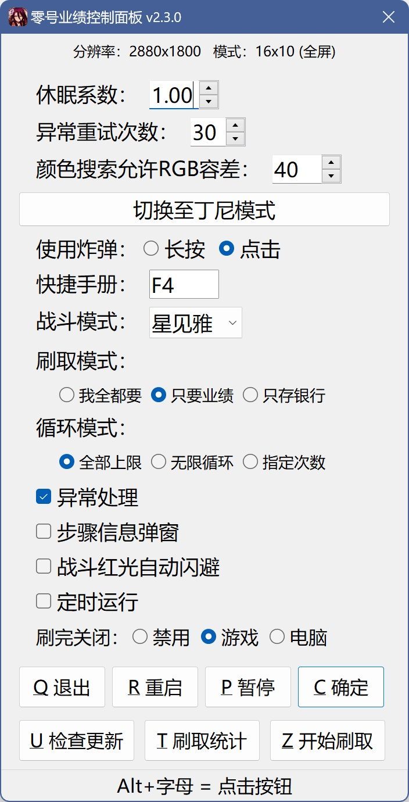

# 绝区零零号业绩刷取脚本

## 简介

- 针对零号空洞 **旧都列车·前线** 关卡设计
- 基于 [**AutoHotKey v2**](https://www.autohotkey.com) 实现的 **零号业绩** 和 **零号空洞银行存款** 快速刷取
    > 约3分钟一把，20业绩+存款到手，3小时不到就能刷满一周900业绩上限
    >  关闭存银行后约2.5分钟一把，2小时就能刷满
- 简单轻量易用，对于不同 **分辨率、帧率、缩放、HDR、游戏内字体粗细等** 具有良好的适应性

## 使用前提

**以下要求缺一不可**

- 1. **全屏** 运行游戏
- 2. 默认 **3位** 战斗角色
- 3. 已激活作战攻略的 **开局炸弹补给**
- 4. 设置要求（系统默认即可）：
    - 快捷手册快捷键：F2（用于进入零号空洞）
    - 棋盘邦布插件快捷使用：长按（用于使用炸弹）

## 下载、打开方法

- 方法一（下载即用，懒人最爱）：

    [<<<点击进入>>>](https://gitee.com/UCPr251/zzzAuto/releases/latest)release最新版本，下载并运行该exe文件

- 方法二（适合想要diy的用户）：

    克隆或下载源码（需已安装好[autohotkey](https://www.autohotkey.com) v2版解释器），运行零号业绩.ahk文件

## 使用方法

- Alt+Z ：启动脚本（自动循环刷取，默认情况下会一直刷取直至零号业绩达到周上限）
- Alt+T ：查看/关闭刷取统计
- Alt+P ：暂停/恢复刷取，快捷指令，也可通过控制面板修改
- Alt+C ：打开/关闭[控制面板](./控制面板.jpg)，可修改项：
    > 休眠系数：调整脚本在加载动画时的等待时长倍率
    > 颜色搜索允许渐变值：对画面区域进行颜色搜索时允许的RGB渐变值，值越大颜色匹配范围越大，0~255
    > 调试日志弹窗：刷取过程每个步骤的信息弹窗
    > 刷完业绩自动关闭游戏：字面意思
    > 银行模式：开启后，不论零号业绩是否达到周上限，都会无限循环刷取，用于刷取银行存款
    > 银行存款：关闭后不再存银行，获取零号业绩后直接退出副本结算
    > 退出：退出脚本
    > 重启：重启脚本，修改分辨率后建议重启脚本
    > 暂停刷取：字面意思
    > 结束刷取：在当前执行的步骤完成后结束本次刷取，再次启动：Alt+Z

控制面板

    

## 注意事项

1. 本脚本基于固定坐标和像素点颜色查找实现，设计分辨率比例：16:9、16:10、5:4、4:3，其他比例待适配。
 如果在不修改分辨率的情况下脚本无法正常运行，建议 **显示器和游戏** 的画面分辨率设置为 **长宽比16:9** 且 **关闭HDR** 后重新运行脚本

2. 由于实现原理较简易，此脚本无法保证在所有情况下都能稳定运行。
 若出现失效、意外报错，请尝试重启脚本后于主界面重新运行。
 若仍无法正常运行，请提出[issue](https://gitee.com/UCPr251/zzzAuto/issues/new?template=bug.yml)并按照[issue](https://gitee.com/UCPr251/zzzAuto/issues/new?template=bug.yml)模板描述提供所需信息

3. 由于电脑配置的差异，实际动画加载时长可能比预设的更久进而导致错误，可使用Alt+C呼出控制面板微调 **休眠系数** 延长全局的等待时长

4. 战斗按照鲨鱼妹设计，其他角色只要哪怕一直a都能S评价即可
    > 战斗时长一般在15~50s以内，超过50s建议换个角色

5. 为避免消息弹窗等的影响，建议在脚本运行期间开启 **免打扰模式**

6. 请勿在脚本运行期间操作键鼠，若需操作请先暂停脚本： **Alt+P**

7. 本脚本完全免费公开， **严禁用于任何商业用途** ，仅供学习交流使用
